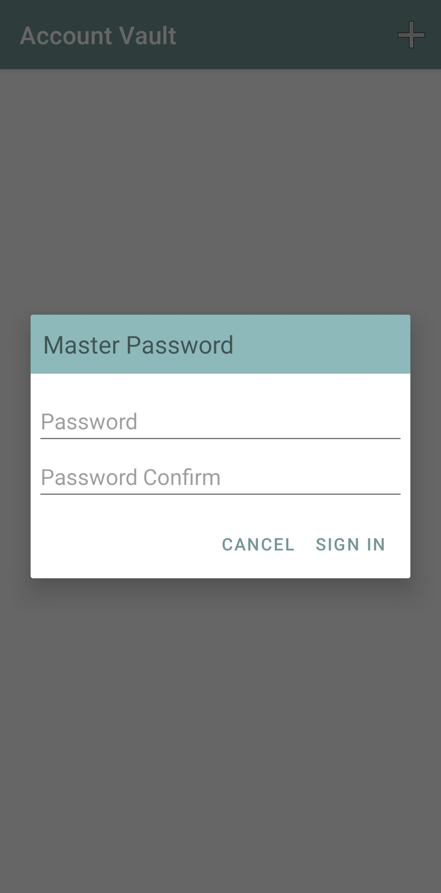
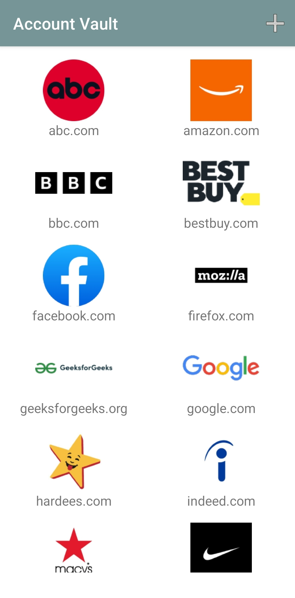
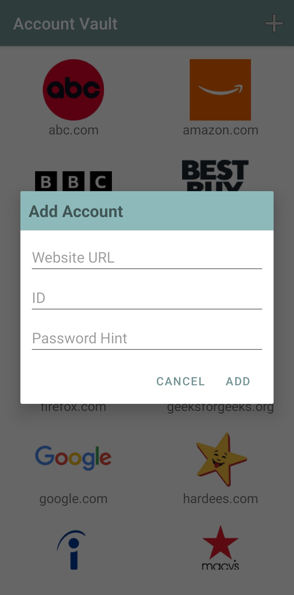
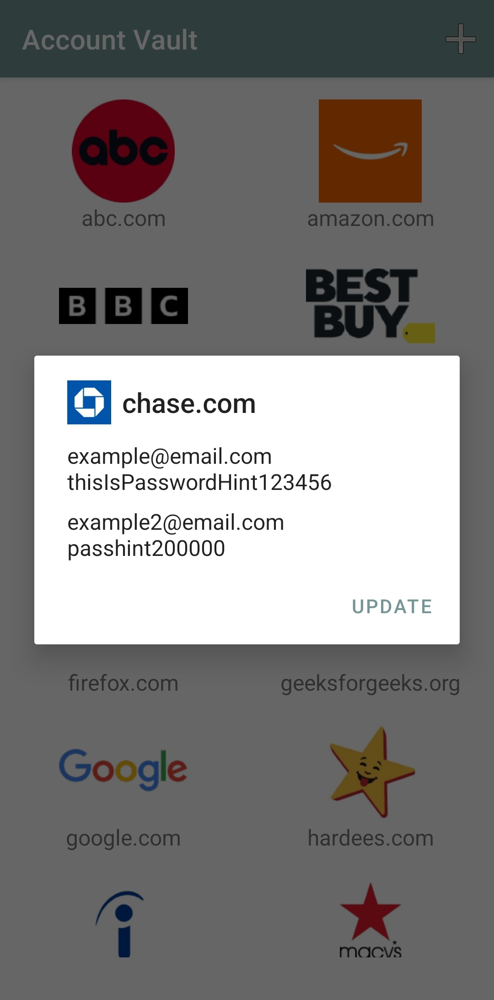
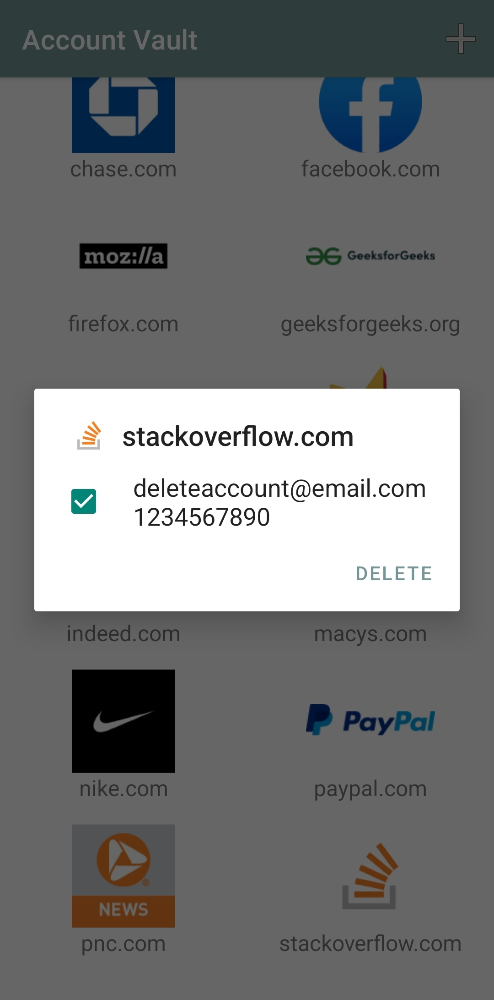
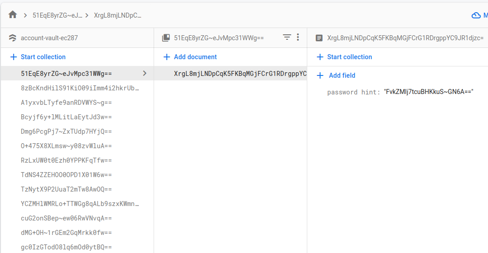

<h1>Account Vault</h1>
This app stores ids and password hints for each website.
Do NOT store the actual password in the database.
The website logo is automatically downloaded.

<h1>Usage</h1>
Get your own "google-service.json" file and move it to app/src/

<h1>Screenshots</h1>

  
  
  

  
  

